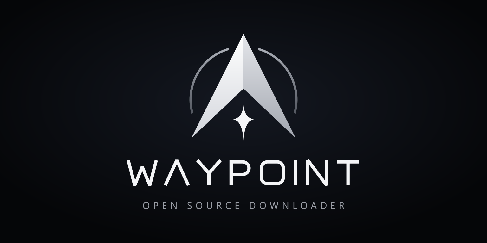

<p align="center"></p>

Waypoint is a Windows batch download manager in the spirit of JDownloader, built for file hosts that sit behind Cloudflare Turnstile. Paste a pile of links, let Waypoint walk them through a real browser one at a time, then download everything in parallel and unpack the archives.

## How it works

1. **Link Grabber.** Paste any text. Waypoint pulls out every URL, drops duplicates, and lists them as *Pending*.
2. **Resolve.** Waypoint opens each link in your installed Chrome (or Edge), one tab at a time, using its own persistent profile. Turnstile usually passes by itself. If it doesn't, the window comes to the front so you can click the check. Waypoint then clicks the host's download button (or waits for you to), catches the file request, and stores the direct URL with the cookies needed to fetch it.
3. **Batch.** Pick a base folder, a batch name, and whether to extract. Files go to `<folder>\<batch name>\`.
4. **Download.** aria2 downloads the files, 4 at a time by default, with several connections per file. You can pause and resume single files, whole batches, or everything. If a host rejects a link because it expired, Waypoint re-resolves it automatically.
5. **Extract.** When every file in the batch has finished, WinRAR extracts each archive set once, starting from its first volume (`.part1.rar`, `.rar` + `.r00`, `.zip`, `.7z`, `.001`). Archives are kept.

Downloads survive restarts: aria2 resumes from its `.aria2` control files the next time Waypoint opens.

## Requirements

- Windows 10 or 11 (x64)
- Google Chrome or Microsoft Edge, used for resolving
- WinRAR, for extraction. Waypoint finds it through the registry, or you can set its path in Settings.

aria2 1.37.0 ships inside the app, so you don't install it separately.

## Development

```bash
npm install
```

Recent npm versions block dependency install scripts unless you approve them. If `node_modules/electron/dist` is missing, or better-sqlite3 fails to load, run:

```bash
node node_modules/electron/install.js
```

```bash
npx electron-builder install-app-deps
```

Then start the app with hot reload:

```bash
npm run dev
```

Other scripts:

| Script | What it does |
| --- | --- |
| `npm run typecheck` | Type-checks main, preload and renderer |
| `npm run build` | Production bundle into `out/` |
| `npm run icons` | Re-renders `build/icon.ico`, `resources/icons/*` and `docs/banner.png` from `design/brand/*.svg` |
| `npm run dist` | Builds the NSIS installer into `dist/` |
| `npm run release` | Builds and publishes the installer to GitHub Releases |

## Releasing and auto-update

Download the latest installer from [Releases](https://github.com/dopeer-creator/Waypoint/releases/latest).

The installed app checks GitHub Releases every time it opens, then every 6 hours. It downloads a new version in the background and installs it silently when you quit. Only the changed parts of the installer are downloaded, using the `.blockmap` file. The current version and a **Check for updates** button sit at the bottom of the sidebar. When an update is ready, a **Restart to update** button appears there too.

To ship a release, bump the version and push the tag:

```bash
npm version patch
```

```bash
git push --follow-tags
```

The `Release` GitHub Actions workflow then builds the installer on Windows. It publishes `Waypoint-Setup-<version>.exe`, its `.blockmap` and `latest.yml` to a release tagged `v<version>`. Use `npm version minor` or `npm version major` for bigger bumps.

To publish from your own machine instead, first create a draft release for the tag on GitHub. Then set `GH_TOKEN` to a GitHub token with `repo` scope and run `npm run release`, which uploads the files into that draft. Publish the draft when the upload finishes.

The installer is unsigned, so Windows SmartScreen warns on first install. Choose "More info → Run anyway", or sign the build with a code-signing certificate.

## Adding a host adapter

Every host goes through `src/main/resolver/generic.ts`, which detects Turnstile and clicks the most likely download control. When a host needs special handling, add an adapter in `src/main/resolver/adapters.ts`:

```ts
export const exampleHost: HostAdapter = {
  ...genericAdapter,
  id: 'example-host',
  match: (url) => url.hostname.endsWith('example-host.com'),
  maxConnections: 1, // host bans parallel connections
  triggerDownload: async (page) => {
    const button = page.locator('#download-button:not([disabled])')
    if (!(await button.isVisible())) return false
    await button.click()
    return true
  }
}
```

Adapters only decide how to verify and trigger. The resolver catches the resulting browser download, so adapters never parse direct links themselves.

## Project layout

```
src/
  main/            Electron main process
    index.ts       window, tray, IPC, clipboard watcher
    db.ts          SQLite store (links, batches, settings)
    resolver/      Playwright resolver and host adapters
    aria2.ts       aria2c process and JSON-RPC client
    downloads.ts   batch scheduling, expiry handling, extraction
    extract.ts     WinRAR detection and archive-set grouping
    updater.ts     electron-updater / GitHub Releases
  preload/         typed contextBridge API
  renderer/        React UI (Link Grabber, Downloads, Settings)
  shared/          types and IPC contract
design/brand/      source SVGs for the logo and wordmark
resources/bin/     bundled aria2c.exe
```

App data (database, logs, resolver browser profile) lives in `%APPDATA%\Waypoint`.

## License

Waypoint is MIT licensed. The bundled `aria2c.exe` is a separate program under GPL-2.0 (see `resources/bin/aria2-COPYING.txt`). Its source is at https://github.com/aria2/aria2.
